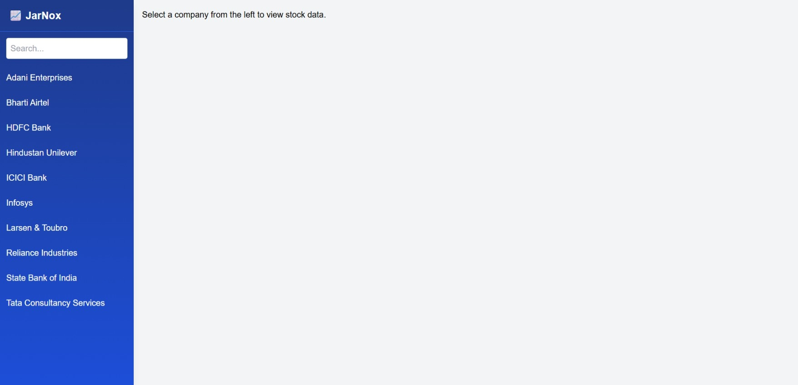
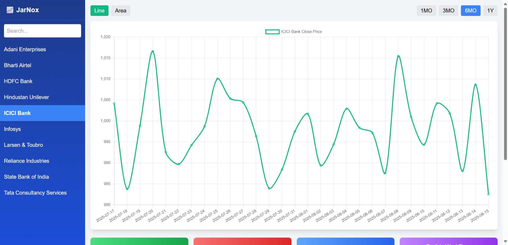
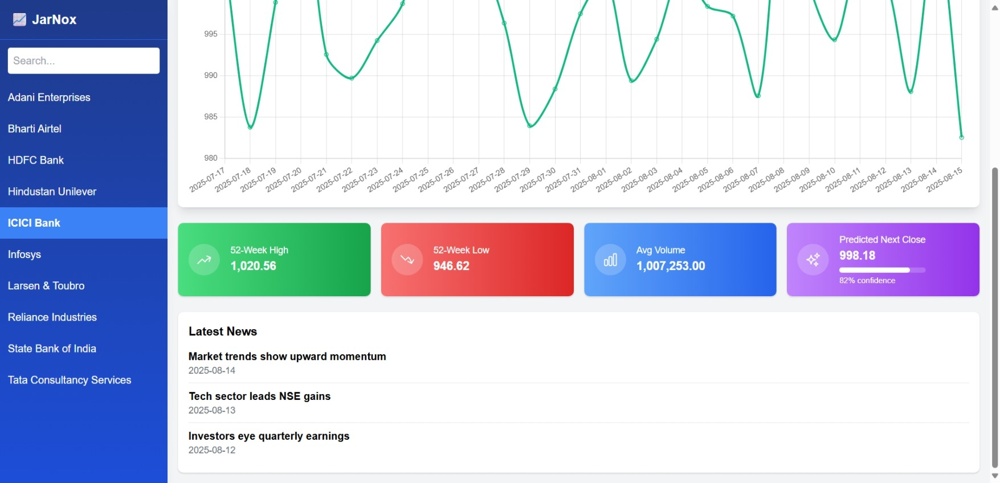

# 📊 Stock Market Dashboard

A full-stack stock market dashboard built with **FastAPI (Backend)** and **React + TailwindCSS (Frontend)**.  
Created for the JarNox Internship Assignment.


## 🚀 Features
- Real & mock stock data fetching
- Historical charts with interactive controls
- 52-week high/low, avg volume, and AI-based prediction
- Dark mode support
- Searchable company list
- Mock news feed
- Fully Dockerized for deployment

## 🛠 Tech Stack
**Backend:** FastAPI, SQLite, yfinance, scikit-learn  
**Frontend:** React, TailwindCSS, Chart.js, Heroicons  
**Deployment:** Docker, docker-compose, Render (backend), Vercel (frontend)
## 📂 Project Structure

```bash
  stock-dashboard/
    ├── backend/ # FastAPI backend
    ├── frontend/ # React frontend
    ├── docker-compose.yml
    └── README.md
```
## 🔧 Local Development

## Clone the repo
```bash
git clone https://github.com/yourusername/stock-dashboard.git
cd stock-dashboard
```
## Start with Docker
```bash
docker-compose up --build
```


 - Backend: http://localhost:8000

 - Frontend: http://localhost:3000
 


# 🌍 Deployment
 - Backend: Deploy [[/backend to Render](https://stock-dashboard-backend-e9r7.onrender.com)]

 - Frontend: Deploy [/frontend to Vercel](https://stock-dashboard-pearl.vercel.app/)

## Screenshots

### Company List


### Dashboard Overview


### Stats & Predictions



## Feedback

If you have any feedback, please reach out to us at priyanshukothari1808@gmail.com
